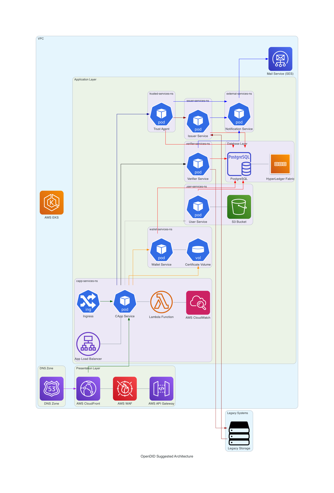

# Tarea01
Tarea01 - Seguridad en la Nube

**Sugerencia de Arquitectura**

El proyecto se centra en la sugerencia de una arquitectura de software para la implementación de la tecnología OmniOne Open DID para la verificación de identidades en formato digital. La verificación de identidades dentro del Instituto Tecnológico de Costa Rica, será el alcance proyecto, como concepto de pruebas inicial. De igual manera se pretende utilizar esta implementación como método de validación de certificados académicos.

Diagrama:

Recomendaciones

Con respecto al diseño base otorgado en el enunciado de la tarea 01, se han realizado un serie de cambios a considerar de carácter personal. Los siguientes serán listados en seguida;

**Presentation Layer:**
	Se sugiere el uso del AWS WAF (Web Application Firewall) como capa de protección para filtrar, monitorear y bloquear solicitudes no reconocidas. Especialmente útil para monitorear el tráfico de red de la aplicación.

**CApp Namespace:**
	Se recomienda mantener el servicio CApp en su propio namespace, debido a que este es el servicio en el cual el usuario tendrá interacción directa para evitar que los servicios de Wallet o Usuario se vean comprometidos, en caso de presentarse alguna vulnerabilidad.
	Se añade un Application Load Balancer para el control de solicitudes de los usuarios y así evitar una sobrecarga en la aplicación, especialmente en las fases iniciales de registro de estudiantes y personal académico.
	Se sugiere el uso de funciones Lambda en la aplicación para que ésta trabaje a través de eventos.
	Se sugiere el uso de AWS CloudWatch en conjunto con las funciones Lambda como método de monitoreo del sistema.

**Wallet Namespace:**
	Se decide mantener el Wallet y el Volumen de Certificados en un namespace en conjunto, debido a que estos son los servicios que estarán interactuando con la implementación de Blockchain de forma más regular para obtener los contratos o hash generados por este último. Se separan del CApp namespace para evitar que este pueda ser comprometido a través de un fácil acceso desde la aplicación.

**User Namespace:**
	Se separa el servicio de Usuario para del CApp para evitar algún problema o manipulación del registro o ingreso de usuarios, debido a que el servicio de Usuario es el encargado de gestionar estos procesos y datos.
	Se considera la alternativa del uso de un bucket S3 para la generación de archivos JSON para gestionar la información de los datos de los estudiantes durante el proceso de transformación de datos y su inserción en la base de datos. Esto funciona como método alternativo de salvaguarda en caso de que el servicio de base de datos tenga algún inconveniente. De manera opcional, se podrían utilizar archivos Parquet para mejorar el rendimiento y costos de almacenamiento.

**Zona DNS:**
	En el diagrama base se presentan 3 zonas de DNS fuera de la nube privada, asumiendo que esto es parte de un sistema heredado o existente. En este caso, se sugiere el uso de solamente una zona DNS para la reducción de costos y simplicidad para su gestión. Esta sugerencia será válida en caso de que la primera afirmación no sea correcta.

**Kubernetes Service:**
	Se sugiere el uso de AWS EKS (Elastic Kubernetes Service) para tomar ventaja del uso de ambiente AWS ejecutar los Kubernetes sugerido en la arquitectura base. Con esto se presentan mejoras de la gestión del Kubernetes y mejoras de escalabilidad en caso de ser necesario a futuro.

**Mail Service:**
	**No valido** para calificar sin embargo se podría hacer uso de AWS SES (Simple Email Service) en conjunto con las funciones Lambda para realizar el envío de correos electrónicos hacia los usuario basado en eventos.
